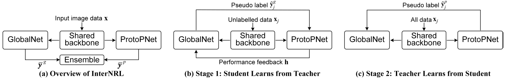
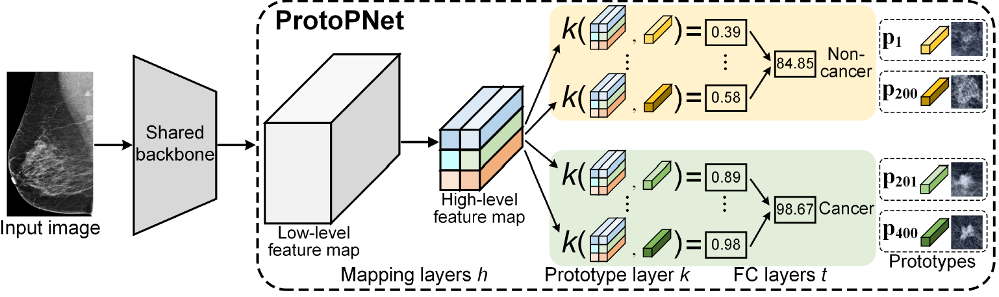
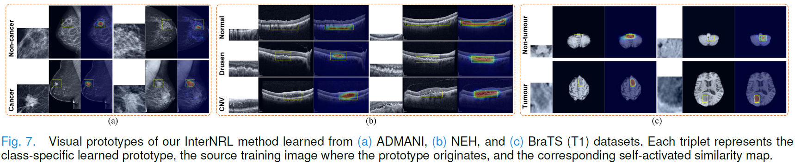
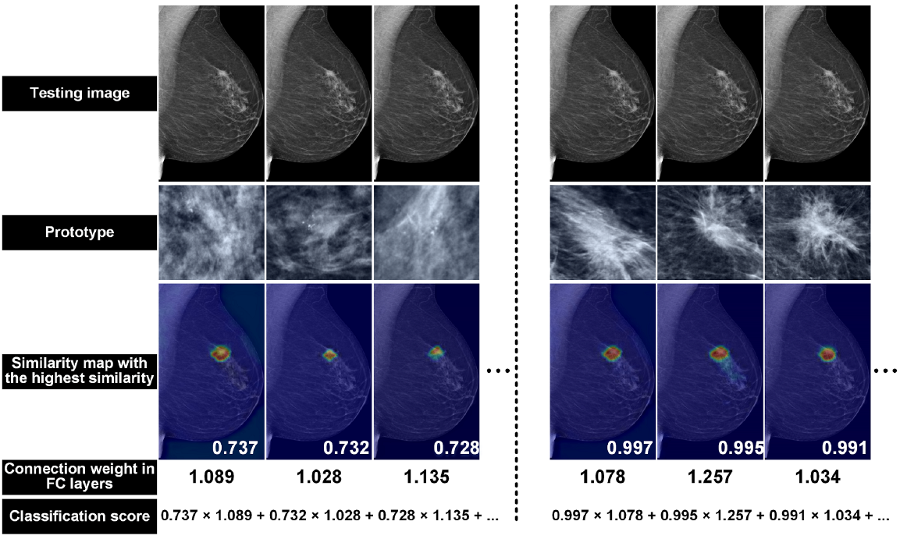

# InterNRL:

This is an __unofficial__ implementation of the paper "An Interpretable and Accurate Deep-Learning Diagnosis Framework Modeled With Fully and Semi-Supervised Reciprocal Learning" ([IEEE TMI 2023](https://ieeexplore.ieee.org/document/10225391)), presenting a deep interpretable framework for diagnosing medical diseases,
e.g., breast cancer in mammograms, retinopathy in optical coherence tomography (OCT) images, and brain tumor in magnetic resonance (MR) images.


<p align="center">

</p>

The method integrates the interpretable prototype-based classifier (ProtoPNet) with existing deep global image classifier (GlobalNet), 
as shown in (a) above, which are optimised with a two-stage reciprocal student-teacher learning paradigm: 
(b) the student ProtoPNet learns from the suitable pseudo labels produced by the teacher GlobalNet and the GlobalNet is trained based on the ProtoPNet’s performance feedback; 
and (c) the teacher GlobalNet is further trained using the pseudo labels produced by the accurate student ProtoPNet.


<p align="center">

</p>

The interpretable ProtoPNet branch, as shown above, classifies images by calculating similarities with class-specific image prototypes that are learned from training data.


***
## Hardware & Software

We re-implement the paper with Pytorch 1.9.1+cu111 on 2 NVIDIA A40 GPUs, and our trained model weights (EfficientNet B0 as backbone) are provided concomitantly.


## Training 

1. Pre-training the GlobalNet branch:
```
 python pretrain_globalnet.py
```

2. Training the ProtoPNet branch, using data samples optimally pseudo-labeled by the teacher GlobalNet:
```
 python train_protopnet.py
```

2. Retraining the GlobalNet branch, using pseudo labels of the accurate ProtoPNet:
```
 python retrain_globalnet.py
```


***

## Cancer Localisation 

The cancer localisation heatmap can be computed using: 
```
 python test_cancer_loc_heatmap.py
```

***


## Visualisation of Prototypes

The authors give visualised prototypes in their paper, together with the corresponding source training images and self-activated similarity maps.


<p align="center">

</p>


## Example of Interpretable Reasoning

As illustrated by the authors, for a testing mammogram, the method classifies it as belonging to the cancer class 
because the abnormality present in the image looks more similar to the cancer prototypes than the non-cancer ones, 
as evidenced by the higher similarity scores with the cancer prototypes.


<p align="center">

</p>


__Please remember to respect the authors and cite their work properly__: 

    @article{wang2023interpretable,
      title={An Interpretable and Accurate Deep-learning Diagnosis Framework Modelled with Fully and Semi-supervised Reciprocal Learning},
      author={Wang, Chong and Chen, Yuanhong and Liu, Fengbei and Elliott, Michael and Kwok, Chun Fung and Pe{\~n}a-Solorzano, Carlos and Frazer, Helen and McCarthy, Davis James and Carneiro, Gustavo},
      journal={IEEE Transactions on Medical Imaging},
      year={2023},
      publisher={IEEE}
    }

